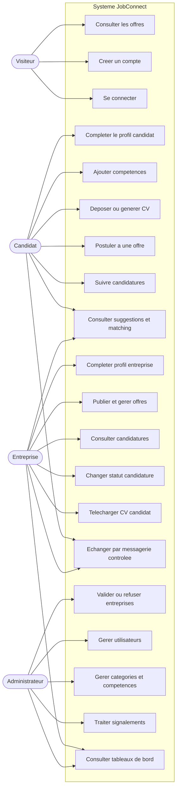
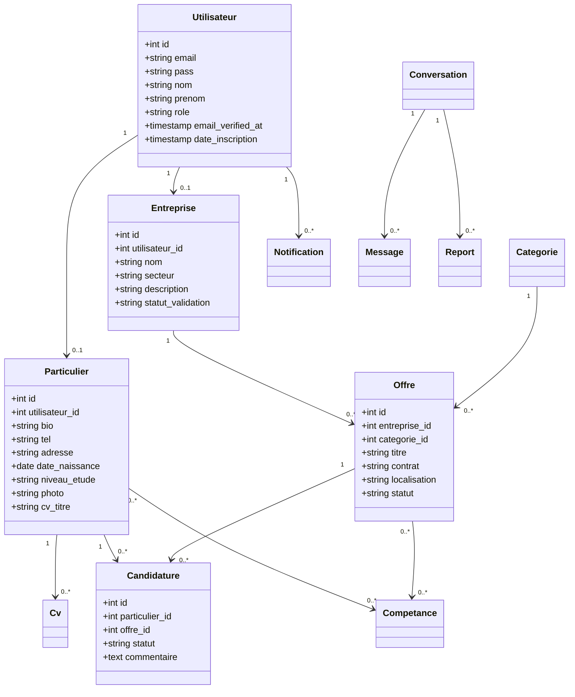
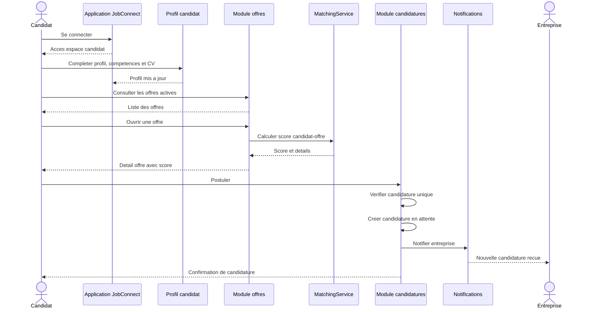
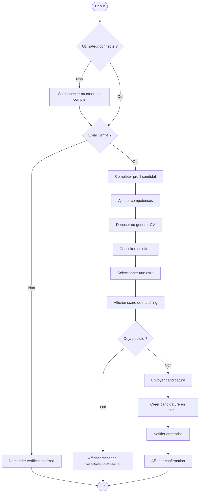
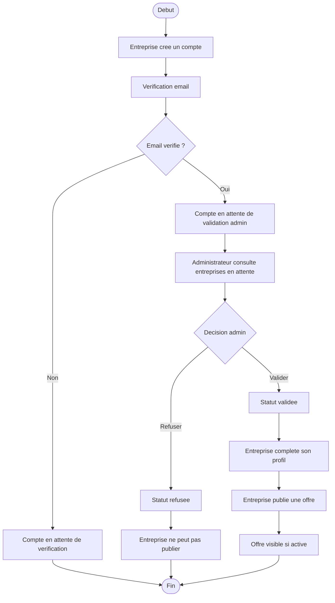

# Diagrammes JobConnect

## 1. Diagramme de cas d'utilisation

## 2. Diagramme de classes

## 3. Diagramme entite-association

Voir `03-entite-association.mmd` pour la version complete.

## 4. Diagramme de sequence - candidature

## 5. Diagramme d'activite - candidature

## 6. Diagramme d'activite - validation entreprise

